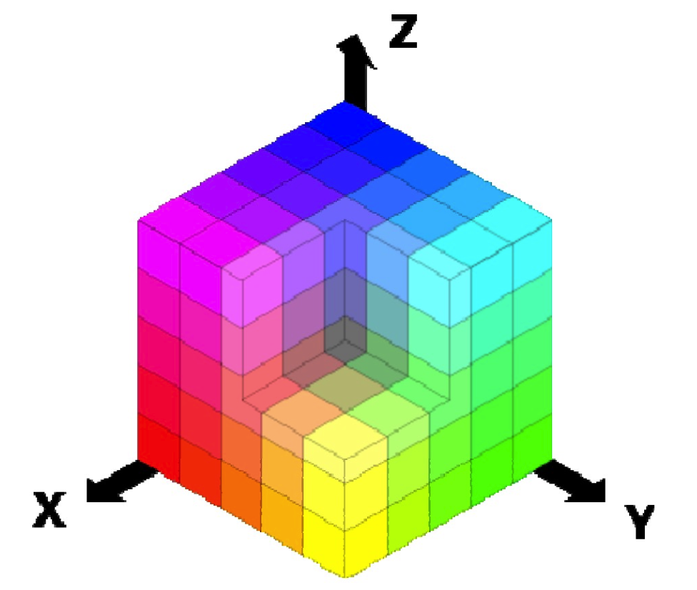

### Basic Info

**Name**: Mei Jiaojiao

**My chosen topic**: Deep learning for classification

**My work**: Deep Learning for Hyperspectral Image Analysis and classification. 
Basically, the paper is about the field of hyper spectral image processing, this is why I choose this name for my work. Specifically,this file is not an explanation or illustration of the paper. It is more like a exploration about hyper spectral image classification using deep learning techniques. This is version one, and if this can make the retake status pass, there would not be a version two. If not, please provide some feedback and I will make changes and modifications carefully based on the feedback. Last but not least, I am so grateful that I was offered this retake chance and also with a kind deadline. This work is based on the book《Deep Learning for Hyperspectral Image Analysis and classification》

**Email**: v6fisc@inf.elte.hu

### Introduction to Hyperspectral Images

Now imagine a normal <u>three-channel RGB</u> picture, it is a combination of <u>Red Green Blue</u>. Black is at the origin and white is at the corner furthest from the origin.The different colors in this model are points on or inside the cube,and are defined by vectors extending from the origin.

All the values of R,G and B are assumed to be in the range [0,1]. The <u>reflectance_wavelength</u> of a normal RGB image is like a <u>discrete</u> function with only three points which is exactly corresponding to red green blue value.

 **what is a Hyper spectral Image?** Well, a normal RGB image has three channels while <u>a hyper spectral image can have hundreds of channels</u>.The <u>reflectance_wavelength</u> of a normal hyper spectral image is like a <u>"continuous"</u> function.

I think everyone agrees here that hyper spectral image provides us with more information than a normal RGB image does. <u>More colors, more information.</u> Just think about that an x-ray image can provide information which is beyond what we see, becuase <u>human eyes can only sense visible wavelength</u>. A hyper spectral image is able to capture a <u>wider range</u> of wavelength.

**Then what kind of information does HSI provide us? How can we do with it?**

HSI have been widely used in analyzing the earth’s surface due to its <u>high distinctive capability to classify and discriminate different materials</u>, which in turn has opened new doors for a vast range of applications such as <u>mineral detection, precision farming, urban planning, environmental monitoring and management, and surveillance.</u> For example,<u>remote sensing scene</u> can also be seen as a pile of scenes taken in <u>diverse wavelengths</u> (spectral channels), which results in a <u>hyperspectral image</u>. Specifically, each spectral channel of the hyperspectral data cube represents a gray-level image as presented in below. The size of the 3D data cube is *L*1 × *L*2 × *S* where *L*1 × *L*2 is the size of each spectral channel while *S* is the total count of spectral bands. More specifically, hyperspectral scene is divided into spectral and spatial characteristics.

### Challenges in Hyperspectral Image Classification

1. <u>Effect of noise and other atmospheric factors</u>. Atmospheric factors can affect light, and light can affect the final imaging results, which may result in the same object having different spectral features when illuminated by different light sources.
2. <u>Curse of dimensionality</u>. Huge model parameters and difficulties when preparing traning dataset come together with the high dimensions.
3. <u>Integration of spectral-spatial information</u>.Spatial and spectral domains are entirely different, each carries distinctive characteristics and properties, how to merge the spectral and spatial information for effective classification is still a challenge.
4. Classification of Diverse Classes in the Presence of <u>Limited Training data.</u>

### Deep Learning Based HSI Classification Techniques

Based on the challenges mentioned before,researchers have developed multiple deep learning based classification methods for HSI. All the challenges are hard challenges,but <u>integrating spatial information along with spectral channels in the HSI classification process</u> is of paramount importance. Focus on this challenge, deep learning techniques can be split into two major groups established on the integration of spatial information and nature of network:

**Integration of spatial information prior to classification**

- Stacked auto-encoder based HSI classification
- Deep Belief Network based HSI classification
- PCANet based HSI classification

**Integration of spatial information after classification**

- Stacked auto-encoder and Hidden Markov Random field based HSI classification
- Deep Belief Network based HSI classification
- segmented DBN based HSI classification

### General framework

It comprises <u>three main phases</u>, preprocessed input data, hierarchical multi-layer core deep model, and the extracted output features and classification. In the first phase, the input vector comprises of either spectral feature vector, spatial feature vector, or spectral-spatial feature vector combined.

#### Noise Detection and Removal

<u>Noise</u> in HSI can be grouped into <u>two</u> main classes [19]: random noise and fixed-pattern noise.

<u>Existing noise-estimation methods</u> can mainly be classified into <u>three</u> types: block- based, filter-based, and their combination.

The hyperspectral image consists of <u>hundreds</u> of spectral channels with a <u>significant amount of redundancy and noise</u> that not only makes the subsequent analysis of HSI, really <u>challenging and difficult</u> but also degrades the performance of subsequent classification algorithms.Channels with dissimilar possessions and features are required for different applications. From these classified channels on the <u>basis of characteristics</u>, it is possible to select the <u>subsets</u> of channels. <u>As an example, the channels with dissimilar features are required for object detection, classification, denoising, noise estimation, and channel selection.</u> On the basis of the movement of boundary movement or boundary adjustment trifactor criteria with the utilization of local structural regularity and self-similarity, the suggested approach, allows the classification of bands based on the level of information contained in each channel. For the consequent applications, issues can also be solved with efficient channel characterization. <u>In a word, it is possible to do a clustering based on the characteristics of channels to filter the useful channels for HSI classification.</u>

#### Hyperspectral Image Spatial Feature Extraction via Segmentation

**The Automatic Segmentation process** completely and effectively <u>explores both spectral and spatial characteristics and spectral relation in neighboring channels.</u> Furthermore, it keeps the dimensional of the HSI data intact that results in exploiting each and every channel for useful correlation and spatial dependencies.It is established on the HSI object edge detection/movement characteristics. Each spectral channel in HSI contains a unique signature for each earth surface material.<u>Dividing the hyperspectral image into $N$ grouped channels</u> and apply the assessment procedure on each group of channels autonomously. Weighted criteria (which is developed on many edge movement factors) is developed and used to extract valuable information enclosed in each channel for segmentation purpose.

More specifically, the automatic segmentation process can be conceptually divided into the following main steps:

1. <u>Divide initial hyperspectral $M$ channel image into $\frac{M}{N}$ N-channel groups.</u> 
2. For each Group of channels, perform the following steps:

Place m initial seeds for m classes in the image.

Based on the seeds, divide the <u>region</u> into m initial hexagonal segments/<u>clusters</u>.

Repeat over the subsequent elementary stages till no additional development is conceivable, i.e., no pixel going to a diverse segment.

- Compute the <u>class centroid</u> of each initial divided segment/cluster.
- Compute the <u>gradient</u> of current boundary pixels of each segment/cluster.
- Compute the <u>straightness factor</u> for each cluster boundary.
- Based on the equation, compute the <u>measurement of similarity</u>, i.e., the force of attraction/repulsion between each class centroid and its edge parts.

3. For each channel cluster,allocate weight to every edge pixel conferring to convinced criteria, to assign pixels which reflects an actual edge.

4. <u>Merge $N$ channel to obtain a weighted segmentation of HSI.</u>

#### Deep Learning Based HSI Classification methods

##### Stacked auto-encoder

<u>Auto-encoder</u> is unsupervised deep learning architecture that perform regeneration of the <u>representation</u> that it receives as an input with compression. <u>Input and output layers in auto-encoder have the same size.</u> The purpose of an auto-encoder is to acquire a compressed distributed depiction for the given input, typically for the purpose of dimensionality reduction and feature extraction. <u>Stacked Auto-Encoder (SAE)</u> is the extension of auto-encoder procedure.It learns a hidden feature from input. For instance, <u>if we use the hidden layer that is much smaller than the input layer</u>, it means auto-encoder is going to <u>compress</u> the information, <u>ignore</u> the part of input that is <u>not useful</u> for reconstructing it and <u>focuses on</u> the part of the input that is more important to extract from it, for subsequent reconstruction. Therefore, it could be used to <u>extract meaning full feature for classification.</u>

 A <u>general flowchart</u> of the framework is presented in below, which consists of <u>three</u> main phases: <u>first,</u> boundary adjustment based channel selection approach is utilized to select the most discriminative and informative channels. <u>Secondly,</u> adaptive boundary movement based segment approach is employed to partition the scene into spatially similar regions. <u>Thirdly,</u> the resulted segmented boundaries are used as adaptive windows for computing SAE-based shallow and deep features. <u>Next,</u> learned spectral-spatial features are fed into multinomial logistic regression (MLR) for classification. 

##### Deep Belief Network

**A Deep Belief Network** can be observed from a perspective of layers of neural network which is generative in nature. Each part consists of Restricted Boltzmann Machine (RBM). It comprises a layer for data input and a hidden layer. <u>Hidden layer learn parameters to characterize data that detect higher order relationship between the received information</u> shown in below.

The entire procedure can be explained in steps as

1. Given data is utilized to make the train the individual layer of DBN. In order to train the particular layer, Contrastive Divergence (CD) is exploited.
2. Utilize the yield of the primary layer as a contribution for a second consecutive layer. Train the next layer in a similar manner.
3. Apply reiteration to 1 and 2 for a numerous number of layers as per requirement.
4. All resulted parameters should be fine tuned with the aid of available training data. Any classifier can be exploited for the given problem. We utilized Logistic Regression (LR) as a classifier.

This framework represents a distinguishing contextually modified deep belief net(SDBN) that effectually <u>employs contextual characteristics</u> inside spectrally matching adjacent pixels <u>for hyperspectral scene classification.</u> In the developed framework, scene is initially partitioned into flexible edge regulation rooted contextually comparable areas that possess the same spectral characteristics, succeeding a structural feature mining and classification is commenced utilizing Deep Belief Network (DBN) rooted outcome merging technique <u>that joins contextually partitioned contextual and spectral data into a DBN network for improved spectral-spatial hyperspectral scene classification.</u> 

### Dataset

1. Indian Pine: AVIRIS Dataset
2. Pavia University: ROSIS Dataset
3. Houston Image: AVIRIS Dataset
4. Salinas Valley: AVIRIS Dataset
5. Moffett Image: AVIRIS Dataset
6. Washington DC Mall Hyperspectral Dataset

### Classification Evaluation Measures

1. Overall accuracy (OA): OA is the percentage of pixels correctly classified.
2. Average accuracy (AA): AA is the mean of all the class-specific accuracies over the total number for classes for the specific image.
3. Kappa Coefficient ($k$): Kappa ($k$) is a degree of agreement between predicted class accuracy and reality. Generally, it is considered more robust than OA and AA.

